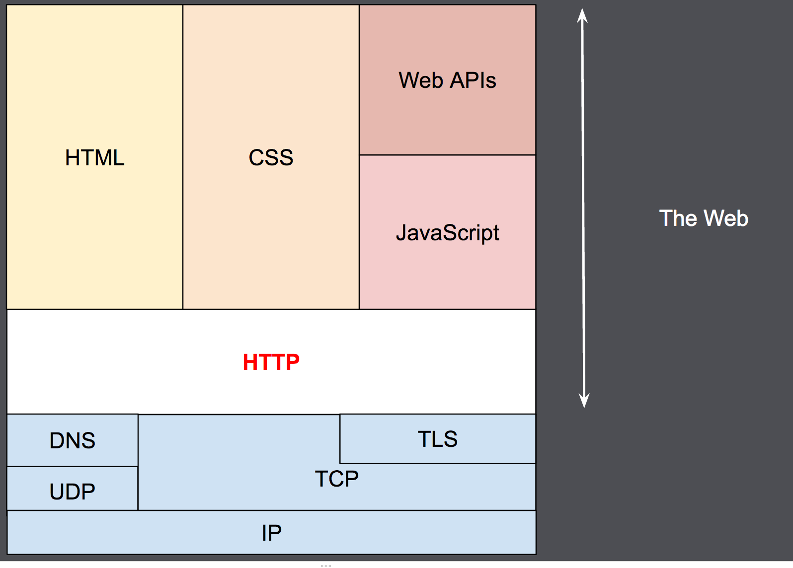

## What is HTTP
HTTP is a protocol which allows the fetching of resources, such as HTML
documents. It is the foundation of any data exchange on the Web and it
is a client-server protocol, which means requests are initiated by the
recipient, usually the Web browser. A complete document is reconstructed
from the different sub-documents fetched, for instance text, layout
description, images, videos, scripts, and more.

Clients and servers communicate by exchanging individual messages (as
opposed to a stream of data). The messages sent by the client, usually a
Web browser, are called requests and the messages sent by the server as
an answer are called responses.

Designed in the early 1990s, HTTP is an extensible protocol which has
evolved over time. It is an application layer protocol that is sent over
TCP, or over a TLS-encrypted TCP connection, though any reliable
transport protocol could theoretically be used. Due to its
extensibility, it is used to not only fetch hypertext documents, but
also images and videos or to post content to servers, like with HTML
form results. HTTP can also be used to fetch parts of documents to
update Web pages on demand.

