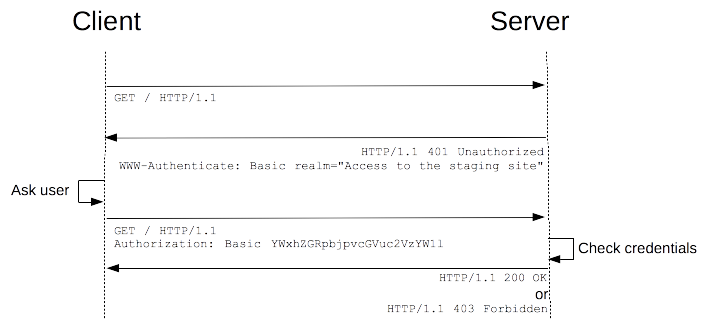

## Authorization
This is a request header and contains the credential to authenticate a
user agent with a server, usually after the server response with a 401
unauthorized status with the `WWW-Authenticate` header.

## Syntax
```
Authorization: <type> <credential>
```

## Authentication Schemas
The general HTTP authentication framework is used by several
authentication schemes. Schemes can differ in security strength and in
their availability in client or server software.

The most common authentication scheme is the "Basic" authentication
scheme which is introduced in more details below. IANA maintains
[a list of authentication schemes](https://www.iana.org/assignments/http-authschemes/http-authschemes.xhtml),
but there are other schemes offered by host services, such as Amazon
AWS. In this section, we just want to introduce common schemes below.

#### Basic Authentication Scheme
The "Basic" HTTP authentication scheme is defined in RFC 7617, which
transmits credentials as user ID/password pairs, encoded using base64.
> The username and password are combined with a
> colon(username:password), then encode it using base64.

- **Security of basic authentication**

    As the user ID and password are passed over the network as clear
    text (it is base64 encoded, but base64 is a reversible encoding),
    the basic authentication scheme is not secure. HTTPS / TLS should be
    used in conjunction with basic authentication. Without these
    additional security enhancements, basic authentication should not be
    used to protect sensitive or valuable information.
    
- **Restricting access with Apache and basic authentication**
    
    To password-protected a directory on a Apache server, you will need
    a `.htaccess` and a `.htpasswd` file. The `.htaccess` file
    references a `.htpasswd` file in which each line consists of a
    username and a password separated by a colon (":"). You cannot see
    the actual passwords as they are encrypted (md5 in this case). Note
    that you can name your `.htpasswd` file differently if you like, but
    keep in mind this file shouldn't be accessible to anyone. (Apache is
    usually configured to prevent access to `.ht*` files).
    
    ```
    ## htaccess
    AuthType Basic
    AuthName "Access to the staging site"
    AuthUserFile /path/to/.htpasswd
    Require valid-user
    
    ## htpasswd
    aladdin:$apr1$ZjTqBB3f$IF9gdYAGlMrs2fuINjHsz.
    user2:$apr1$O04r.y2H$/vEkesPhVInBByJUkXitA/
    ```
    
- **Restricting access with nginx and basic authentication**

    For nginx, you will need to specify a location that you are going to
    protect and the auth_basic directive that provides the name to the
    password-protected area. The `auth_basic_user_file` directive then
    points to a `.htpasswd` file containing the encrypted user
    credentials, just like in the Apache example above.
    
    ```
    location /status {                                       
        auth_basic           "Access to the staging site";
        auth_basic_user_file /etc/apache2/.htpasswd;
    }
    ```
    
#### Bearer Authorization Scheme
The `Bearer` HTTP authorization is described in
[RFC6750](https://tools.ietf.org/html/rfc6750), which enable clients to
access protected resources with an access token. Tokens are issued to
client by an authorization server with the approval of the resource
owner.

## General HTTP Authentication Framework
[RFC 7235](https://tools.ietf.org/html/rfc7235) defines the HTTP
authentication framework which can be used by a server to challenge a
client request and by a client to provide authentication information.
The challenge and response flow works like this: The server responds to
a client with a 401 (Unauthorized) response status and provides
information on how to authorize with a WWW-Authenticate response header
containing at least one challenge. A client that wants to authenticate
itself with a server can then do so by including an Authorization
request header field with the credentials. Usually a client will present
a password prompt to the user and will then issue the request including
the correct Authorization header.



>In the case of a "Basic" authentication like shown in the figure, the
>exchange must happen over an HTTPS (TLS) connection to be secure.