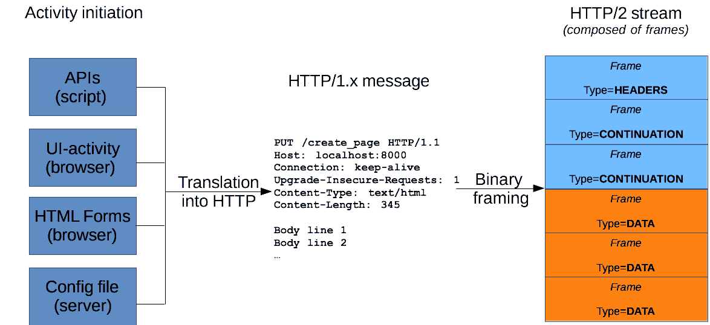

## HTTP Message
HTTP messages are how data is exchanged between a server and a client.
There are two types of messages: requests sent by the client to trigger
an action on the server, and responses, the answer from the server.

HTTP messages are composed of textual information encoded in ASCII, and
span over multiple lines. In HTTP/1.1, and earlier versions of the
protocol, these messages were openly sent across the connection. In
HTTP/2, the once human-readable message is now divided up into HTTP
frames, providing optimization and performance improvements.

Web developers, or webmasters, rarely craft these textual HTTP messages
themselves: software, a Web browser, proxy, or Web server, perform this
action. They provide HTTP messages through config files (for proxies or
servers), APIs (for browsers), or other interfaces.

The HTTP/2 binary framing mechanism has been designed to not require any
alteration of the APIs or config files applied: it is broadly
transparent to the user.

HTTP requests, and responses, share similar structure and are composed of:

1. A start-line describing the requests to be implemented, or its status
   of whether successful or a failure. This start-line is always a
   single line.

2. An optional set of HTTP headers specifying the request, or describing
   the body included in the message.

3. A blank line indicating all meta-information for the request have
   been sent.

4. An optional body containing data associated with the request (like
   content of an HTML form), or the document associated with a response.
   The presence of the body and its size is specified by the start-line
   and HTTP headers.
   
The start-line and HTTP headers of the HTTP message are collectively
known as the head of the requests, whereas its payload is known as the
body.

