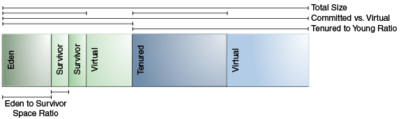

## Sizing the heap
At initialization of the virtual machine, the entire space for the heap is reserved. 
The size of the space reserved can be specified with the `-Xmx` option. 
If the value of the `-Xms` parameter is smaller than the value of the `-Xmx` parameter, 
than not all of the space that is reserved is immediately committed to the virtual machine. 
The uncommitted space is labeled "virtual" in this figure. 
The different parts of the heap (tenured generation and young generation) can grow to the limit of the virtual space as needed.

## Total Heap
The following discussion regarding growing and shrinking of the heap and default heap sizes does not apply to the parallel collector.
However, the parameters that control the total size of the heap and the sizes of the generations do apply to the parallel collector.

By default, the virtual machine grows or shrinks the heap at each collection to try to keep the proportion of free space to live objects 
at each collection within a specific range. 
This target range is set as a percentage by the parameters `-XX:MinHeapFreeRatio=<minimum>` and `-XX:MaxHeapFreeRatio=<maximum>`, 
and the total size is bounded below by `-Xms<min>` and above by `-Xmx<max>`.

Default parameter values for Heap size

|Parameter|Default Value|
|:----|:----|
| MinHeapFreeRatio | 40 |
| MaxHeapFreeRatio | 70 |
| -Xms | 6656K |
| -Xmx | calculated |

With these parameters, if the percent of free space in a generation falls below 40%, 
then the generation will be expanded to maintain 40% free space, up to the maximum allowed size of the generation. 
Similarly, if the free space exceeds 70%, then the generation will be contracted so that only 70% of the space is free, 
subject to the minimum size of the generation.

By default, the maximum heap size is a value that is calculated by the JVM. 
The calculation used in Java SE for the parallel collector and the server JVM are now used for all the garbage collectors.

## Young Generation
After total available memory, the second most influential factor affecting garbage collection performance is 
the proportion of the heap dedicated to the young generation. The bigger the young generation, 
the less often minor collections occur. However, for a bounded heap size, a larger young generation implies a smaller tenured generation, 
which will increase the frequency of major collections. 
The optimal choice depends on the lifetime distribution of the objects allocated by the application.

By default, the young generation size is controlled by the parameter `NewRatio`. 
For example, setting `-XX:NewRatio=3` means that the ratio between the young and tenured generation is `1:3`. In other words, 
the combined size of the eden and survivor spaces will be one-fourth of the total heap size.

The parameters `NewSize` and `MaxNewSize` bound the young generation size from below and above. 
Setting these to the same value fixes the young generation, just as setting `-Xms` and `-Xmx` to the same value fixes the total heap size. 
This is useful for tuning the young generation at a finer granularity than the integral multiples allowed by `NewRatio`.

##  Survivor Space Sizing
You can use the parameter `SurvivorRatio` can be used to tune the size of the survivor spaces, 
but this is often not important for performance. 
For example, `-XX:SurvivorRatio=6` sets the ratio between eden and a survivor space to 1:6. In other words, 
each survivor space will be `one-sixth` the size of eden, and thus one-eighth the size of the young generation (not one-seventh, 
because there are two survivor spaces).

If survivor spaces are too small, copying collection overflows directly into the tenured generation. 
If survivor spaces are too large, they will be uselessly empty. At each garbage collection, 
the virtual machine chooses a threshold number, which is the number times an object can be copied before it is tenured. 
This threshold is chosen to keep the survivors half full. 
The command line option `-XX:+PrintTenuringDistribution` (not available on all garbage collectors) can be used to show this threshold 
and the ages of objects in the new generation. It is also useful for observing the lifetime distribution of an application.
